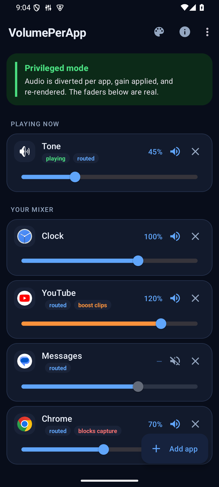
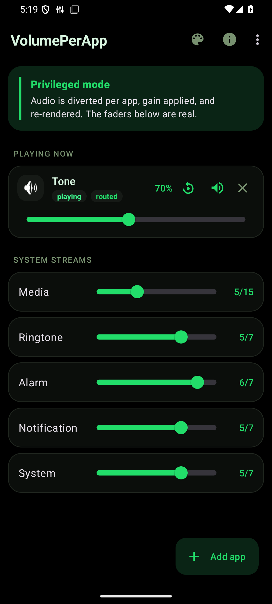

# VolumePerApp

A real per-app volume mixer for Android. One slider per app, on one screen.

Android has no per-app volume. `AudioManager` gives you *stream* volume — media,
ring, alarm — and volume *groups*, which key off `AudioAttributes` (an automotive
concept) and never off a uid or a package. Everything an ordinary app can reach
is global or read-only.

VolumePerApp gets it anyway, by being a privileged system app: it registers an
`AudioPolicy` containing one `AudioMix` per target uid, flagged for loopback.
The platform stops sending that app's audio to the speaker and hands it to
VolumePerApp instead; VolumePerApp scales the samples and renders them back out.

**Divert, attenuate, re-render.** No hooks, no patched `AudioTrack`, nothing that
breaks when some other process updates.

|  |  |
|---|---|
|  |  |

---

## What it needs

- **Root**, with **Magisk**. The APK has to live in `/system/priv-app` to be
  granted `MODIFY_AUDIO_ROUTING`, which is `signature|privileged`.
- **Android 10 (API 29) or newer.** The uid-matching `AudioMix` does not exist
  before then. Developed and measured against **Android 15 / API 35**.

### Known working on

| Device | Android | ROM | Root |
|---|---|---|---|
| OnePlus 12 (`CPH2583`) | 15 (API 35) | OxygenOS V15.0.0 | Magisk 30.1 |
| Android emulator (`sdk_gphone64_x86_64`) | 15 (API 35) | AOSP | priv-app install by hand |

Both are API 35, which is the level the hidden call chain was pinned against —
so those constants are confirmed rather than assumed on the hardware. A vendor
ROM is the real risk in this design, since OEMs do patch framework; OxygenOS is
the one that has been tried. If you run it somewhere else, **Diagnostics** will
tell you whether the chain is intact on your build, and a report of either
outcome is welcome.

Without root the app still installs and runs, in **Limited mode**: the system
stream faders work, playback detection works, and the per-app faders are visibly
marked as inert rather than silently doing nothing.

## Using it

Each app gets a channel strip: a fader from 0 % to the ceiling you choose
(100 / 150 / 200 / 400 %), a mute, and a **reset** that puts it back to 100 % and
unmutes in one tap. The reset only appears once a strip is adjusted, so a strip
at 100 % stays uncluttered.

The fader also has a **detent at 100 %** — release within 2 % and it lands
exactly on 100, because a one-step slider across that range otherwise makes 100 a
pixel-wide target. It snaps on release rather than mid-drag, so a deliberate 93 %
is left alone.

Apps currently making sound are pinned to the top under **Playing now**, whether
or not you have added them.

## Install

1. Flash `dist/VolumePerApp-magisk-v<version>.zip` in Magisk → Modules →
   Install from storage.
2. Reboot.
3. Open VolumePerApp. The banner at the top of the mixer says **Privileged mode**
   when it worked.

If it still says Limited, open **Diagnostics** from the toolbar. It walks the
same call chain the engine walks and names the step that failed — missing
permission, non-privileged install, or a hidden API that moved on your build.

Optionally grant notification-listener access (toolbar → *Grant playback
detection*). That is what `MediaSessionManager.getActiveSessions()` requires, and
it is how apps appear in **Playing now** without you adding them. The app reads
no notifications; the permission is the only way to reach that call.

## How it works

```
                     ┌──────────────────────────────────────────┐
  Spotify (uid N) ──▶│ AudioMix                                 │
                     │   rule       RULE_MATCH_UID = N          │
                     │   routeFlags ROUTE_FLAG_LOOP_BACK        │
                     │   format     48 kHz stereo PCM 16        │
                     └──────────────────┬───────────────────────┘
                                        │ audio no longer reaches the speaker
                                        ▼
                        AudioPolicy.createAudioRecordSink(mix)
                                        │
                                        ▼
                          StreamPump — sample * gain, clamped
                                        │
                                        ▼
                     AudioTrack (VolumePerApp's own uid) ──▶ speaker
```

- **`ROUTE_FLAG_LOOP_BACK` only**, never `ROUTE_FLAG_LOOP_BACK_RENDER`. Adding
  RENDER would send the *untouched* stream straight to a device as well, which
  is the opposite of attenuating it.
- **An app at 100 % is never routed.** No mix, no thread, no added latency.
  "Leave it alone" costs nothing.
- **Routed ≠ pumping.** A mix stays attached for any adjusted app; the pump
  thread and its `AudioTrack` exist only while that app is actually playing.
- Adding or removing an app uses `AudioPolicy.attachMixes` / `detachMixes` where
  the build has them (API 35 does), so one app's fader does not interrupt
  another's audio. Older builds fall back to rebuilding the policy.
- Latency: one ~10 ms buffer. Irrelevant for music, noticeable in games.

### Layout

```
app/src/main/java/com/volumeperapp/app/
  audio/
    Hidden.java              reflection over android.media.audiopolicy, with
                             named failures instead of stack traces
    AudioPolicyBridge.java   the only class that speaks AudioPolicy/AudioMix
    StreamPump.java          one diverted app: read, scale, write, meter
    RoutingEngine.java       decides *when* to divert; owns the routed/pumping sets
    PlaybackWatcher.java     who is playing, from two sources that each miss things
    MixerService.java        foreground service holding the engine
  data/                      VolumeStore (prefs), AppRepository, AppEntry
  ui/                        MixerActivity, AppPickerActivity, DiagnosticsActivity
magisk/                      the Magisk module tree
tools/probe/                 pins the hidden API against a real device
tools/tone/                  test fixture: an app that only emits a known tone
docs/hidden-api-api35.txt    what that probe found on Android 15
```

## Building

```sh
./gradlew :app:assembleRelease          # unsigned APK
tools/build-magisk.sh <signed.apk>      # packages the module zip into dist/
```

The release builds published here are signed out-of-tree, so this repo contains
no key and no `keystore.properties`. `app/build.gradle` reads one if you add it,
and produces an unsigned APK if you don't.

## Verifying it actually works

The interesting failure mode is a fader that moves and changes nothing, so the
app measures itself rather than asking you to trust it. `StreamPump` records the
peak sample it read and the peak it wrote; Diagnostics reports both and their
ratio.

`tools/tone/` is a fixture app that emits a 440 Hz sine at exactly 0.5 full
scale. Route it, set a fader, and read the numbers back:

| Fader | peak in | peak out | measured gain |
|------:|--------:|---------:|--------------:|
|   0 % |   16383 |        0 |         0.000 |
|  25 % |   16383 |     4096 |         0.250 |
|  50 % |   16383 |     8192 |         0.500 |
| 150 % |   16383 |    24575 |         1.500 |
| muted |   16383 |        0 |         0.000 |

Measured on Android 15 / API 35 with the signed release build installed as a
priv-app. `dumpsys audio` independently confirms the diversion: the routed app
sits on the remote-submix device while VolumePerApp holds the speaker.

**What the emulator does and does not prove.** It proves the engine: the gain
numbers above are real, and the diversion is visible from outside the app. It
does **not** prove the permission plumbing — the AOSP emulator does not enforce
`MODIFY_AUDIO_ROUTING`, and a build installed to `/data/app` under a different
application id, with the permission ungranted and no `PRIVILEGED` flag, still
registers its policy successfully there. So a working emulator build is not
evidence that the Magisk module is doing anything. Only a real device shows that.

The same build has since been flashed as a Magisk module on a OnePlus 12
(Android 15, OxygenOS V15.0.0, Magisk 30.1) and works there, so the numbers above
are not an emulator artefact.

## Known limits

- **Apps that opt out of playback capture cannot be diverted.** An app with
  `android:allowAudioPlaybackCapture="false"` (Chrome, for one) yields silence
  through a loopback mix. The mixer marks those **blocks capture** rather than
  showing a fader that lies.

  There is a lever for this and it is not worth pulling:
  `AudioMixingRule.allowPrivilegedPlaybackCapture(true)` would capture them, but
  it puts the mix on the platform's privileged-capture path, which is capped at
  **16 kHz mono** by design. Asking for 48 kHz stereo alongside it throws
  outright. Every app would sound like a phone call so that a handful could be
  turned down.

- **A fader is per *uid*, not per package.** Apps sharing a `sharedUserId` share
  a fader. The app picker shows each app's uid so this is visible before you set
  one, rather than surprising you later.

- **Boost above 100 % clips.** It is a real amplifier, not a restored headroom
  trick. Samples are clamped, so overdrive distorts rather than wrapping into
  noise. The ceiling is a setting (toolbar → *Fader ceiling*) and 100 % —
  attenuate only, cannot clip — is one of the choices.

- **Hidden API drift.** `AudioPolicy` and `AudioMixingRule` are not public and do
  move between releases. Everything goes through `Hidden.java`, which reports a
  missing member by name; Diagnostics shows that report. Re-run
  `tools/probe/Probe.java` against a new Android version before assuming
  anything.

## Building it yourself

Nothing in this repo is machine-specific: there is no `local.properties`, no
`keystore.properties` and no key. `./gradlew :app:assembleRelease` produces an
unsigned APK; sign it with your own key, then run `tools/build-magisk.sh` to get
a flashable module around it. A module signed by a different key than one already
installed will need the old one removed first, as usual.

## Licence

No licence is granted. The source is published to be read, corrected and learned
from — particularly the parts about which hidden calls exist and which of them
are traps. If you want to do something with it that a missing licence prevents,
ask.
